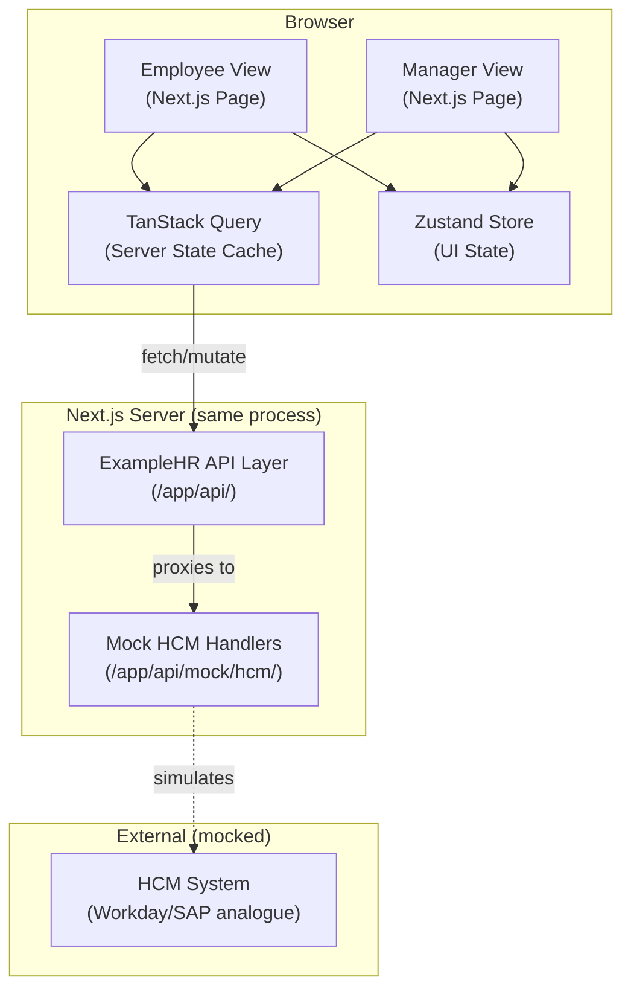

# ExampleHR Time-Off Frontend — Implementation Plan

> **Spec**: ExampleHR Time-Off Module  
> **Stack mandated**: Next.js (App Router) + Storybook  
> **Date drafted**: 2026-04-25

---

## Table of Contents

1. [Problem Summary](#1-problem-summary)
2. [Requirements](#2-requirements)
3. [Technology Decisions (ADRs)](#3-technology-decisions-adrs)
4. [System Architecture](#4-system-architecture)
5. [Data Layer Design](#5-data-layer-design)
6. [Optimistic Update Strategy](#6-optimistic-update-strategy)
7. [Cache Invalidation Strategy](#7-cache-invalidation-strategy)
8. [Background Refresh + In-Flight Action Reconciliation](#8-background-refresh--in-flight-action-reconciliation)
9. [Mock HCM Endpoint Design](#9-mock-hcm-endpoint-design)
10. [Component Tree](#10-component-tree)
11. [UI State Inventory](#11-ui-state-inventory)
12. [Storybook Coverage Plan](#12-storybook-coverage-plan)
13. [Test Strategy](#13-test-strategy)
14. [File & Folder Structure](#14-file--folder-structure)
15. [Risks & Mitigations](#15-risks--mitigations)

---

## 1. Problem Summary

ExampleHR is a UI layer over an HCM system (Workday/SAP analogue). The HCM owns all
balance data; ExampleHR cannot push to it atomically, cannot subscribe to its mutations, and
cannot fully trust its success responses. The core tension:

| Desire | Constraint |
|--------|-----------|
| Instant, confident feedback to the employee | HCM may reject the write asynchronously |
| Balance shown to the manager is current | HCM mutates balances out-of-band (anniversary, year-start) |
| No "approved → actually denied" surprise | Success response from HCM can be a lie |
| Graceful degradation when HCM is slow/silent | ExampleHR does not control HCM uptime |

---

## 2. Requirements

### 2.1 Functional Requirements

| ID | Requirement |
|----|------------|
| F-01 | Employee can see their time-off balances, one row per location |
| F-02 | Employee can submit a time-off request for a specific location |
| F-03 | Employee gets immediate visual feedback on submission (optimistic) |
| F-04 | Employee is never told "approved" and then later "denied" without a clear reconciliation UI |
| F-05 | Manager can see all pending requests with the live balance at decision time |
| F-06 | Manager can approve or deny a request |
| F-07 | Manager's approval reflects the canonical balance, not a cached one |
| F-08 | Stale balances are surfaced to the user with a staleness indicator |
| F-09 | If the balance refreshes while the employee has the app open, they are notified non-intrusively |
| F-10 | If an optimistic update is rolled back, the user sees a clear recovery UI with reason |

### 2.2 Non-Functional Requirements

| ID | Requirement |
|----|------------|
| N-01 | Balance display latency < 100ms (served from cache) on subsequent loads |
| N-02 | Initial page load hydrated from batch endpoint (single round-trip) |
| N-03 | Every meaningful UI state has a Storybook story |
| N-04 | Test suite covers optimistic mutation, rollback, and reconciliation paths |
| N-05 | Mock HCM endpoints are runnable locally with a single command |
| N-06 | No silent data loss — all HCM contradictions surface to the user |

### 2.3 Constraints

- Next.js App Router (mandated)
- Storybook (mandated)
- Balances are keyed by `(employeeId, locationId)` — a single employee may have multiple rows
- Agentic development — the plan must be precise enough for an agent to write all code

---

## 3. Technology Decisions (ADRs)

### ADR-001: TanStack Query for Server State

**Status**: Accepted

**Context**: The data layer must handle caching, background refetch, staleness tracking,
optimistic mutations with rollback, and deduplication of concurrent requests. All of these are
hard to build correctly from scratch.

**Decision**: Use **TanStack Query v5** (React Query) as the primary server-state manager.

**Alternatives Considered**:
- **SWR** — simpler API but weaker mutation model; no first-class `onMutate`/rollback pattern.
- **Redux RTK Query** — excellent for normalized entity caches but adds significant boilerplate; the entity model here is simple enough not to need normalization.
- **Custom fetch + Context** — full control but rebuilds everything TanStack Query already provides; high risk of subtle cache bugs.

**Consequences**:
- Positive: `useMutation` + `onMutate` gives us the optimistic-update/rollback pattern out of the box. `refetchInterval`, `refetchOnWindowFocus`, and `staleTime` give us the reconciliation knobs we need.
- Negative: Adds a dependency. Cache key design requires discipline.
- Trade-off: Standardized patterns > bespoke solution for a problem this well-understood.

---

### ADR-002: Zustand for Client-Only UI State

**Status**: Accepted

**Context**: TanStack Query handles server state. We still need lightweight client state for: which request form is open, notification toasts queue, in-flight mutation tracking (to gate background refreshes), and the reconciliation banner.

**Decision**: Use **Zustand** (tiny, no boilerplate, no Context wrapping needed).

**Alternatives Considered**:
- **useState/useReducer lifted to Context** — works but creates prop-drilling or context hell for deeply nested notification triggers.
- **Redux** — overkill for this scope.
- **Jotai atoms** — fine, but Zustand's slice pattern integrates cleaner with mutation lifecycle hooks.

**Consequences**:
- Positive: Minimal bundle cost (~1KB), straightforward slice design, no Provider tree.
- Trade-off: Two state libraries in one project. Mitigated by strict separation — TanStack Query = server truth, Zustand = UI ephemeral state.

---

### ADR-003: Optimistic Updates (not Pessimistic)

**Status**: Accepted

**Context**: The requirements call for "instant feedback." Pessimistic updates (block the UI until HCM confirms) fail this requirement and create a poor UX, especially if HCM is slow.

**Decision**: Use **optimistic updates** with mandatory post-confirmation reconciliation.

**Key rule**: We never mark a request as definitively "Approved" until the canonical re-read from HCM confirms the balance was actually deducted. The optimistic state uses the label **"Pending confirmation"**, not "Approved."

**Consequences**:
- Positive: Instant feedback, smooth UX.
- Negative: Rollback UI must be implemented and polished — it is not a rare case.
- Trade-off: Complexity in the mutation lifecycle is the cost of honest, fast UX.

See Section 6 for the full optimistic update lifecycle.

---

### ADR-004: Polling + Window Focus Refetch for Reconciliation (no WebSockets)

**Status**: Accepted

**Context**: HCM can mutate balances out-of-band (anniversary bonuses, year-start resets). We need to detect these without the user having to refresh.

**Decision**: Use TanStack Query's `refetchInterval` (30s) + `refetchOnWindowFocus` (true) for background reconciliation. No WebSocket/SSE.

**Alternatives Considered**:
- **WebSocket/SSE push from HCM** — ideal but the spec treats HCM as an external system we do not control. Polling is the realistic integration pattern.
- **Webhook from HCM → ExampleHR backend → push to client** — correct long-term architecture but out of scope for this frontend-only implementation.

**Consequences**:
- Positive: Simple, works with any HTTP HCM, no server infrastructure needed.
- Negative: Up to 30s lag for out-of-band balance changes. Mitigated by window-focus refetch.
- Trade-off: Acceptable staleness window vs infrastructure simplicity.

---

### ADR-005: Next.js Route Handlers for Mock HCM

**Status**: Accepted

**Context**: Mock HCM endpoints must be runnable locally and exercisable by Storybook. MSW would work in Storybook but not in integration tests. Next.js route handlers run in the same process as the app and are reachable by both.

**Decision**: Implement mock HCM as **Next.js App Router route handlers** under `/app/api/mock/hcm/`.

**Consequences**:
- Positive: Single command to run everything. Storybook can be configured to hit the same endpoints (or MSW can delegate to them). Integration tests use the real network stack.
- Negative: Mock behavior is tied to Next.js runtime. Mitigated by keeping mock logic in a plain `lib/mock-hcm/` module that is framework-agnostic.

---

## 4. System Architecture



**Data flow summary**:
1. App loads → TanStack Query fetches batch corpus from `/api/mock/hcm/balances` (hydration).
2. Per-cell real-time reads hit `/api/mock/hcm/balance?employeeId=Y&locationId=X`.
3. Writes hit `/api/mock/hcm/requests` (optimistically reflected in cache instantly).
4. Background polling re-reads the batch or per-cell endpoints and reconciles cache.

---

## 5. Data Layer Design

### 5.1 Query Key Design

Every cached value is identified by a structured tuple. Discipline here prevents stale reads and over-invalidation.

| Data | Query Key | Stale Time | Refetch Interval |
|------|-----------|-----------|-----------------|
| All balances for employee | `['balances', employeeId]` | 30s | 30s |
| Single balance (per-cell) | `['balance', employeeId, locationId]` | 10s | on-demand |
| Pending requests (employee) | `['requests', 'employee', employeeId]` | 60s | on-focus |
| Pending requests (manager) | `['requests', 'manager', managerId]` | 15s | 15s |
| Single request detail | `['request', requestId]` | 30s | on-focus |

### 5.2 HCM API Abstraction

All HCM calls are routed through a service module (`lib/hcm-client.ts`) that:
- Wraps fetch with typed request/response shapes
- Enforces a configurable timeout (default 8s) — surfaces a `HCMTimeoutError` rather than hanging
- Tags every response with a `fetchedAt` timestamp used by the staleness indicator

```
lib/
  hcm-client.ts          # typed fetch wrapper
  hcm-types.ts           # Balance, Request, Employee types
  query-keys.ts          # centralized query key factory
```

### 5.3 Core Types

```typescript
// Balance keyed by (employeeId, locationId)
type Balance = {
  employeeId: string;
  locationId: string;
  locationName: string;
  available: number;        // days available (from HCM)
  pending: number;          // optimistic deductions in-flight
  fetchedAt: number;        // ms timestamp of last HCM read
};

// A time-off request through its full lifecycle
type TimeOffRequest = {
  id: string;
  employeeId: string;
  locationId: string;
  days: number;
  startDate: string;        // ISO date
  endDate: string;
  status: RequestStatus;
  optimisticState?: OptimisticState;
  hcmRejectionReason?: string;
};

type RequestStatus =
  | 'draft'
  | 'pending-hcm'           // submitted, awaiting HCM write confirmation
  | 'pending-manager'       // HCM accepted, awaiting manager approval
  | 'approved'              // manager approved + canonical re-read confirmed
  | 'denied'
  | 'rolled-back';          // optimistic rolled back due to HCM contradiction

type OptimisticState =
  | 'submitting'
  | 'pending-confirmation'  // HCM returned 200 but canonical re-read not yet done
  | 'confirming'            // canonical re-read in progress
  | 'rolled-back';
```

---

## 6. Optimistic Update Strategy

### 6.1 The Lifecycle (step-by-step)

```
Employee submits request (N days, locationId)
│
├─ 1. [OPTIMISTIC] Snapshot current cache for (employeeId, locationId)
│      Zustand: add requestId to `inFlightMutations` set
│      TanStack: setQueryData → subtract N from balance.available, add N to balance.pending
│      UI: BalanceRow shows optimistic balance + "Pending confirmation" badge
│
├─ 2. [WRITE] POST /api/mock/hcm/requests
│   │
│   ├─ HCM returns 200 (success)
│   │   ├─ 3a. [VERIFY] Immediately re-fetch per-cell balance for (employeeId, locationId)
│   │   │       (Do NOT trust the 200. The balance must have actually moved.)
│   │   │
│   │   ├─ 3b. Canonical balance matches expectation
│   │   │       → Status: 'pending-manager'
│   │   │       → Zustand: remove from inFlightMutations
│   │   │       → TanStack: set canonical balance (clears optimistic pending)
│   │   │       → UI: "Request submitted — awaiting manager approval"
│   │   │
│   │   └─ 3c. Canonical balance did NOT move (silent success / stale)
│   │           → Status: 'rolled-back'
│   │           → TanStack: roll back to snapshot
│   │           → Zustand: remove from inFlightMutations, queue rollback toast
│   │           → UI: show RollbackBanner with "Balance unchanged — please try again"
│   │
│   └─ HCM returns error (4xx / 5xx / timeout)
│       → Status: 'rolled-back'
│       → TanStack: roll back to snapshot
│       → Zustand: remove from inFlightMutations, queue error toast
│       → UI: show error reason if available ("Insufficient balance") else generic
│
└─ 4. [MANAGER APPROVAL]
        Before rendering the approval modal:
          → Fresh per-cell balance re-fetch for (employeeId, locationId)
          → If balance < request.days: surface "Balance insufficient — cannot approve"
          → POST /api/mock/hcm/approve
          → On success: invalidate `['requests', 'manager', managerId]`
          → On failure: surface contradiction UI ("Balance changed since review")
```

### 6.2 Never Say "Approved" Prematurely

The word **"Approved"** only appears in the UI after:
1. The manager has explicitly approved (POST confirmed), AND
2. A canonical re-read of the balance confirms the deduction happened.

Until both conditions are met, the status label is **"Pending confirmation"**.

---

## 7. Cache Invalidation Strategy

### 7.1 Staleness Rules

| Trigger | Action |
|---------|--------|
| `staleTime` exceeded (per-cell: 10s, batch: 30s) | Mark data stale; refetch on next access |
| Window regains focus | Refetch all active queries |
| `refetchInterval` fires (30s for batch, 15s for manager view) | Background refetch |
| Post-mutation (any write) | Immediately invalidate related queries and refetch |
| User explicitly clicks "Refresh" | Invalidate all balance queries |

### 7.2 Staleness Indicator

Every `BalanceDisplay` component receives a `fetchedAt` timestamp. If `Date.now() - fetchedAt > STALE_THRESHOLD_MS` (60s), it renders a **StalenessIndicator** ("Balance as of 2 min ago") alongside a manual refresh button.

This is separate from TanStack Query's internal staleness — this is a UX signal to the user, not just a refetch trigger.

### 7.3 Post-Mutation Invalidation

After any write (submit request, approve, deny):
```typescript
// Invalidate the specific balance cell
queryClient.invalidateQueries({ queryKey: ['balance', employeeId, locationId] });
// Invalidate the full batch (so the BalanceSummaryGrid stays consistent)
queryClient.invalidateQueries({ queryKey: ['balances', employeeId] });
// Invalidate request lists
queryClient.invalidateQueries({ queryKey: ['requests'] });
```

---

## 8. Background Refresh + In-Flight Action Reconciliation

### 8.1 The Race Condition

Scenario: Employee submits a request (optimistic update in progress). 30 seconds later, the
polling refetch fires and returns a balance that doesn't include the optimistic deduction (because
HCM hasn't committed it yet). If we blindly apply the refetch result, we lose the optimistic state
and confuse the user.

### 8.2 Resolution Strategy

1. **Zustand `inFlightMutations` set**: Every in-progress mutation registers its `(employeeId, locationId)` key.
2. **TanStack Query `onSuccess` refetch callback**: Before applying a background refetch result, check if the cell key is in `inFlightMutations`.
   - If yes: **hold the background update** (do not call `setQueryData` with the stale-from-HCM value). Schedule a re-read 5 seconds after the mutation settles.
   - If no: Apply the background data normally.
3. **After mutation settles** (step 3a/3b/3c in Section 6.1): Remove from `inFlightMutations` and trigger an immediate per-cell refetch to get the true canonical value.

### 8.3 Balance Changed Mid-Session (Anniversary Bonus / Year-Start)

Scenario: Employee has the app open. HCM fires a work-anniversary bonus, adding 5 days. The
next polling cycle fetches a higher balance than what is shown.

Resolution:
1. Background refetch returns a new balance.
2. There is no in-flight mutation for this cell.
3. TanStack Query updates the cache (new balance applied to UI automatically).
4. Zustand detects the balance increased and queues a `BalanceRefreshedNotification` toast: "Your balance for [Location] was updated to 15 days."
5. If the balance **decreased** (unexpected — could be an external request), a more prominent `ConflictBanner` is shown: "Your balance was reduced to 8 days by an external update."

Detection logic: in the TanStack Query `onSuccess` handler for balance queries, compare
`previousBalance.available` with `newBalance.available`. If different and no in-flight mutation
exists for this cell, dispatch to Zustand notification queue.

---

## 9. Mock HCM Endpoint Design

All endpoints live under `/app/api/mock/hcm/`. Business logic lives in `lib/mock-hcm/` (pure functions, no Next.js coupling) so they can be tested independently.

### 9.1 In-Memory State

The mock HCM maintains an in-memory store (`lib/mock-hcm/store.ts`):
```
employees: Map<employeeId, Employee>
balances:  Map<`${employeeId}:${locationId}`, Balance>
requests:  Map<requestId, TimeOffRequest>
```
Seeded with deterministic fixture data on server start.

### 9.2 Endpoints

#### `GET /api/mock/hcm/balance`
Real-time per-cell read. Query params: `employeeId`, `locationId`.

**Simulation behaviors** (controlled by `?simulate=` param or random probability):
- Normal: returns balance + `fetchedAt`
- `simulate=slow`: adds 4s delay
- `simulate=timeout`: never responds (tests timeout handling)
- `simulate=error`: returns 503

---

#### `GET /api/mock/hcm/balances`
Batch corpus. Query params: `employeeId`.

Returns all balance rows for the employee. Expensive — mock adds a 500ms delay to simulate real cost. No simulation overrides needed; just used for hydration and reconciliation.

---

#### `POST /api/mock/hcm/requests`
Submit a time-off request.

Request body: `{ employeeId, locationId, days, startDate, endDate }`

**Simulation behaviors**:
- Normal: Deducts from balance, creates request in `pending-manager` state, returns `{ requestId, status: 'accepted' }`
- Insufficient balance: Returns 409 `{ error: 'INSUFFICIENT_BALANCE', available: N }`
- Invalid dimension: Returns 400 `{ error: 'INVALID_DIMENSION' }`
- Silent success (20% probability or `simulate=silent-success`): Returns 200 but does NOT deduct balance. This tests the "success can be a lie" path.
- Timeout (`simulate=timeout`): Never responds.

---

#### `POST /api/mock/hcm/requests/:id/approve`
Manager approves a request.

Before approving: validates current balance ≥ request.days. If not (balance changed since
request was submitted), returns 409 `{ error: 'BALANCE_CHANGED', currentBalance: N }`.

---

#### `POST /api/mock/hcm/requests/:id/deny`
Manager denies a request. Restores the held balance. Returns 200.

---

#### `POST /api/mock/hcm/trigger-anniversary`
Test-only endpoint. Adds `bonusDays` to `(employeeId, locationId)`. Used by Storybook interaction
tests and integration tests to simulate out-of-band balance mutations.

Body: `{ employeeId, locationId, bonusDays }`

---

### 9.3 Failure Mode Matrix

| Behavior | Trigger | Expected Frontend Response |
|----------|---------|--------------------------|
| Slow response (4s) | `simulate=slow` | Loading spinner, no freeze |
| Timeout (no response) | `simulate=timeout` | Error after 8s with retry CTA |
| 503 Server Error | `simulate=error` | Error toast, balance rolled back |
| 409 Insufficient Balance | Balance < days requested | "Insufficient balance" inline error, no rollback needed (pessimistic for this error) |
| Silent success | Random 20% or `simulate=silent-success` | Rollback after canonical re-read fails to confirm deduction |
| 409 Balance Changed (on approval) | Manager approves stale request | Contradiction UI on manager approval modal |
| Anniversary bonus | Timer or POST trigger | Non-intrusive toast "Balance updated to N days" |

---

## 10. Component Tree

```
app/
├── layout.tsx                          # QueryClientProvider, ZustandProvider, ToastProvider
│
├── employee/[employeeId]/
│   └── page.tsx                        # Employee root page
│       └── <EmployeeShell>
│           ├── <PageHeader> (name, current date)
│           ├── <BalanceSummaryGrid>     # fetches batch corpus on mount
│           │   └── <BalanceRow> × N    # one per locationId
│           │       ├── <BalanceDisplay>
│           │       │   ├── <AvailableDays>
│           │       │   ├── <PendingDays>         # optimistic deductions
│           │       │   └── <StalenessIndicator>  # if fetchedAt is old
│           │       └── <RequestButton>           # opens RequestModal
│           ├── <RequestModal>           # controlled by Zustand `openRequestModal`
│           │   ├── <LocationDisplay>
│           │   ├── <DateRangePicker>
│           │   ├── <DayCountDisplay>    # calculated days
│           │   └── <SubmitButton>       # triggers mutation
│           ├── <ActiveRequestsList>     # employee's own pending/approved requests
│           │   └── <RequestStatusCard> × N
│           │       ├── <StatusBadge>   # draft | pending-hcm | pending-manager | approved | denied | rolled-back
│           │       └── <RollbackDetail> (if rolled-back)
│           └── <NotificationStack>     # global toasts (balance updated, rollback, etc.)
│
├── manager/[managerId]/
│   └── page.tsx                        # Manager root page
│       └── <ManagerShell>
│           ├── <PageHeader>
│           ├── <PendingApprovalsList>
│           │   └── <ApprovalCard> × N
│           │       ├── <EmployeeInfo>
│           │       ├── <RequestSummary> (dates, days)
│           │       ├── <LiveBalancePanel>  # fresh per-cell fetch at render time
│           │       │   ├── <BalanceDisplay>
│           │       │   └── <BalanceFreshnessLabel> ("Balance as of 5 seconds ago")
│           │       ├── <ApproveButton>
│           │       └── <DenyButton>
│           └── <ApprovalConflictModal>  # shown when 409 BALANCE_CHANGED on approval
│
└── shared/components/
    ├── BalanceDisplay/
    ├── StalenessIndicator/
    ├── StatusBadge/
    ├── RollbackBanner/
    ├── BalanceRefreshedToast/
    ├── ConflictBanner/
    └── LoadingSkeleton/
```

---

## 11. UI State Inventory

Every state that can be rendered must be explicitly designed. This inventory drives both the
Storybook stories and the test suite.

| State ID | Component | Description | Visual Treatment |
|----------|-----------|-------------|-----------------|
| `loading` | BalanceSummaryGrid | Initial fetch in progress | Skeleton rows (shimmer) |
| `empty` | BalanceSummaryGrid | Employee has no balance rows | "No balances configured" empty state |
| `loaded` | BalanceSummaryGrid | Normal display with fresh data | Balance rows with available days |
| `stale` | BalanceRow | `fetchedAt` > 60s ago | Amber staleness badge + refresh icon |
| `refreshing` | BalanceRow | Background refetch in progress | Subtle spinner, data still visible |
| `optimistic-pending` | BalanceRow | Request submitted, HCM not yet confirmed | Strikethrough original, showing new balance + "Pending" badge |
| `optimistic-rolled-back` | BalanceRow + RequestStatusCard | HCM rejected or silent success detected | Balance restored, RollbackBanner with reason |
| `hcm-rejected` | RequestModal | Explicit 4xx from HCM (e.g., insufficient balance) | Inline form error, no optimistic state was applied |
| `hcm-timeout` | RequestModal | HCM did not respond within 8s | "Request timed out" error with retry CTA |
| `hcm-silently-wrong` | RequestStatusCard | HCM returned 200 but balance didn't move | Same as rolled-back; reason: "HCM did not record the deduction" |
| `balance-refreshed-up` | NotificationStack | Background fetch shows higher balance (e.g., anniversary) | Green toast "Your balance was updated to N days" |
| `balance-refreshed-down` | ConflictBanner | Background fetch shows lower balance (external write) | Amber ConflictBanner "Your balance was reduced externally" |
| `manager-approval-conflict` | ApprovalConflictModal | Balance < request.days at approval time | Modal: "Balance changed since request — approve anyway?" |
| `manager-balance-loading` | LiveBalancePanel | Per-cell fetch in progress on approval card | Skeleton in balance panel |
| `request-approved` | RequestStatusCard | Manager approved, canonical re-read confirmed | Green "Approved" badge |
| `request-denied` | RequestStatusCard | Manager denied | Grey "Denied" badge with optional reason |

---

## 12. Storybook Coverage Plan

Storybook is deployed with a single `npm run storybook` command. Each story uses MSW handlers
to simulate HCM behaviors independently of the Next.js mock server.

### Story Files

```
src/features/time-off/**/components/**/<Component>.stories.tsx

Examples (already present in this repo):
- `src/features/time-off/employee/components/BalanceSummaryGrid/BalanceSummaryGrid.stories.tsx`
- `src/features/time-off/employee/components/BalanceRow/BalanceRow.stories.tsx`
- `src/features/time-off/shared/components/StalenessIndicator/StalenessIndicator.stories.tsx`
```

### Storybook Interaction Tests

For each story that involves user interaction, use `@storybook/test` to write play functions:

- **OptimisticPending**: Click "Request 2 days" → assert balance changes to optimistic value → assert "Pending" badge appears
- **OptimisticRolledBack**: Click submit → MSW handler returns 200 but no balance deduction → assert balance restored → assert RollbackBanner visible
- **HCMRejected**: Click submit → MSW returns 409 → assert inline error shown → assert balance unchanged
- **ConflictOnApproval**: Click "Approve" → MSW returns 409 BALANCE_CHANGED → assert ConflictModal appears
- **BalanceRefreshedUp**: Render Loaded story → trigger anniversary MSW event → assert toast appears with new balance

---

## 13. Test Strategy

### 13.1 Test Pyramid

```
                    ┌───────────┐
                    │ E2E Tests │  (Playwright — optional, run against full app)
                   ─┤           ├─
                  / └───────────┘ \
                 /                 \
         ┌──────────────┐   ┌──────────────────┐
         │  Integration │   │    Storybook     │
         │    Tests     │   │ Interaction Tests│
         │  (Vitest)    │   │  (@storybook/test│
         └──────────────┘   └──────────────────┘
                 \                 /
                  \               /
              ┌───────────────────────┐
              │   Unit / Hook Tests   │
              │  (Vitest + RTL)       │
              └───────────────────────┘
```

### 13.2 Unit / Hook Tests (Vitest + React Testing Library)

**What they guard**: Pure logic — mutation lifecycle, rollback detection, staleness computation, query key factory.

| Test File | What It Tests |
|-----------|--------------|
| `lib/hcm-client.test.ts` | Fetch wrapper timeout, error classification |
| `lib/query-keys.test.ts` | Key factory correctness |
| `hooks/useBalance.test.ts` | Stale flag computation, fetchedAt logic |
| `hooks/useSubmitRequest.test.ts` | Optimistic update application, rollback on failure |
| `hooks/useRequestMutation.test.ts` | Silent-success detection (canonical re-read shows no deduction) |
| `store/notifications.test.ts` | Toast queue add/remove, deduplication |
| `store/inFlightMutations.test.ts` | Add/remove mutation, gate logic for background refresh |
| `components/StalenessIndicator.test.tsx` | Renders at correct age threshold |
| `components/StatusBadge.test.tsx` | Correct label per RequestStatus |
| `components/RollbackBanner.test.tsx` | Shows reason when provided |

### 13.3 Integration Tests (Vitest + Mock HCM Route Handlers)

These tests run the full data layer against the mock HCM handlers (imported directly, not via network, for speed). They guard the wiring between TanStack Query and the HCM client.

| Test Scenario | Guard Against |
|--------------|--------------|
| Batch hydration → per-cell refetch shows consistent data | Cache key collision bugs |
| Submit request → optimistic update → HCM 200 → canonical re-read confirms | Happy path regression |
| Submit request → HCM timeout → rollback | Timeout handling regression |
| Submit request → HCM silent success → canonical re-read shows no change → rollback | Silent success detection regression |
| Background poll fires during in-flight mutation → balance not overwritten | Race condition regression |
| Background poll shows higher balance (anniversary) → toast dispatched | Out-of-band mutation detection |
| Manager approval → balance sufficient → approved | Manager approval happy path |
| Manager approval → 409 BALANCE_CHANGED → conflict modal triggered | Approval conflict regression |

### 13.4 Storybook Interaction Tests

Run via `@storybook/test-runner` in CI. Guard against UI state regressions — verifying the right
components render in the right state, not just that logic is correct.

**Coverage target**: Every state in Section 11 must have at least one Storybook story with a play function asserting the key visual output.

### 13.5 What Each Test Layer Guards

| Layer | Guards | Does NOT Guard |
|-------|--------|----------------|
| Unit/Hook | Business logic, state transitions | UI rendering, network integration |
| Integration | Data layer wiring, HCM interaction contracts | UI rendering, visual states |
| Storybook Interaction | UI states, component behavior under user interaction | Business logic |
| E2E (optional) | Full user flows end-to-end | Individual component edge cases |

This separation means: a future contributor cannot change the optimistic rollback logic without breaking integration tests, cannot change the StatusBadge labels without breaking Storybook tests, and cannot change the query key structure without breaking unit tests.

---

## 14. File & Folder Structure

```
examplehr-timeoff/
├── src/
│   ├── app/                                     # Next.js App Router (routing only)
│   │   ├── layout.tsx                           # Server Component; imports <Providers>
│   │   ├── page.tsx                             # Root entry (will redirect to employee/manager)
│   │   └── api/mock/hcm/                         # Thin route handlers
│   │       ├── balance/route.ts                  # GET single balance
│   │       ├── balances/route.ts                 # GET batch corpus
│   │       ├── requests/route.ts                 # POST submit request
│   │       ├── requests/[id]/approve/route.ts
│   │       ├── requests/[id]/deny/route.ts
│   │       └── trigger-anniversary/route.ts
│   │
│   ├── features/time-off/                        # Domain slices
│   │   ├── employee/
│   │   │   ├── components/                       # Co-located components + tests + stories
│   │   │   │   ├── BalanceSummaryGrid/
│   │   │   │   ├── BalanceRow/
│   │   │   │   └── RequestModal/
│   │   │   └── hooks/                            # useBalance/useBalances/useSubmitRequest
│   │   ├── manager/                              # (to be implemented)
│   │   │   ├── components/
│   │   │   └── hooks/
│   │   └── shared/
│   │       ├── components/                       # BalanceDisplay, StalenessIndicator, etc.
│   │       └── types/                            # Balance, TimeOffRequest
│   │
│   ├── lib/                                      # Framework-agnostic utilities
│   │   ├── hcm-client.ts
│   │   ├── query-keys.ts
│   │   └── mock-hcm/                             # Pure mock business logic + store
│   │       ├── store.ts
│   │       ├── fixtures.ts
│   │       └── logic.ts
│   │
│   ├── store/                                    # Zustand slices (UI-only)
│   │   ├── in-flight-mutations.ts
│   │   ├── notifications.ts
│   │   └── modal.ts
│   │
│   ├── providers/                                # Keeps layout.tsx a Server Component
│   └── stories/                                  # Storybook MDX/docs assets (optional)
│
├── tests/                                        # Integration tests (to be implemented)
│   └── integration/
│
├── .storybook/
│   ├── main.ts
│   └── preview.tsx                 # QueryClient per-story; MSW setup will be added
│
├── package.json
├── next.config.ts
└── TRD.md                          # The Technical Requirements Document (deliverable; to be added)
```

---

## 15. Risks & Mitigations

| Risk | Likelihood | Impact | Mitigation |
|------|-----------|--------|-----------|
| Silent success from HCM goes undetected | High (20% simulated) | High — user thinks request was filed | Mandatory canonical re-read after every 200 response; rollback if balance unchanged |
| Background refetch overwrites optimistic state | Medium | Medium — user sees balance "jump" | `inFlightMutations` gate in Zustand (Section 8.2) |
| Manager approves on stale balance | Medium | High — approval on insufficient funds | Fresh per-cell fetch on ApprovalCard mount + 409 handling on approve mutation |
| HCM timeout during submission hangs UI | Medium | Medium — user unsure if request was filed | 8s client-side timeout, explicit timeout error state, retry CTA |
| Anniversary bonus during in-flight mutation creates confusion | Low | Low — toast may be premature | Hold balance-increased notification until in-flight mutation settles |
| Query key collision causes wrong data in UI | Low | High — shows wrong employee's balance | Centralized query key factory + unit tests for key shapes |
| Storybook MSW handlers diverge from real mock logic | Medium | Medium — stories lie about real behavior | Integration tests import `lib/mock-hcm/logic.ts` directly; same functions used by both |

---

## Appendix: Key Design Decisions Summary

| Question | Decision | Rationale |
|----------|---------|-----------|
| Optimistic vs pessimistic? | Optimistic with mandatory canonical re-read | Instant UX; honesty enforced by re-read, not trust in HCM 200 |
| When to trust HCM 200? | Never unconditionally | Per the spec: "assume a success response can still be wrong" |
| How to detect silent success? | Compare balance before/after mutation via per-cell re-read | Simple, deterministic, no HCM cooperation needed |
| Cache invalidation trigger? | Post-mutation + 30s polling + window-focus | Covers both user-driven and out-of-band mutations |
| How to label pending requests? | "Pending confirmation" not "Approved" | Prevents false confidence before canonical re-read |
| Mock HCM location? | Next.js route handlers | Single command, reachable by Storybook + integration tests |
| State management split? | TanStack Query (server) + Zustand (UI) | Each tool at what it is best at; clear boundary |
| Manager balance freshness? | Re-fetch on ApprovalCard mount, not from cache | Ensures decision is made on current data, not potentially stale cache |
